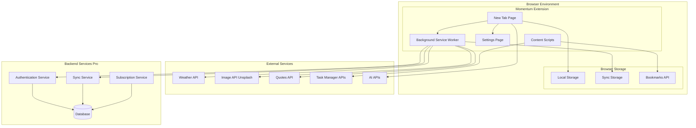
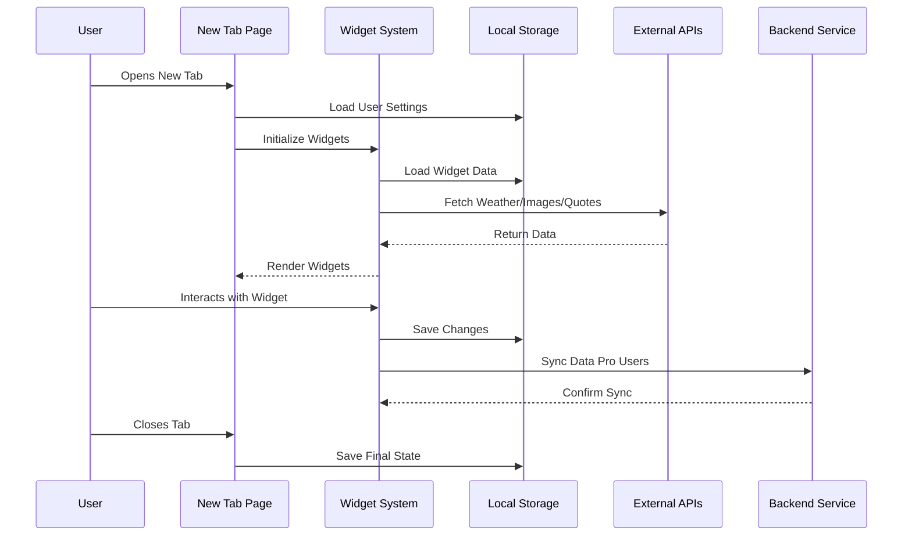
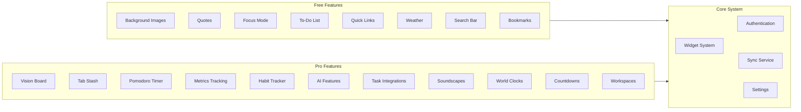
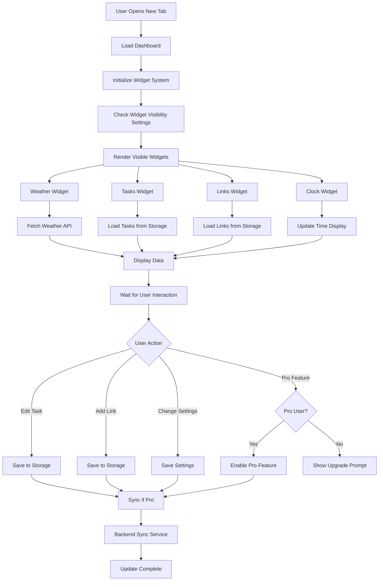
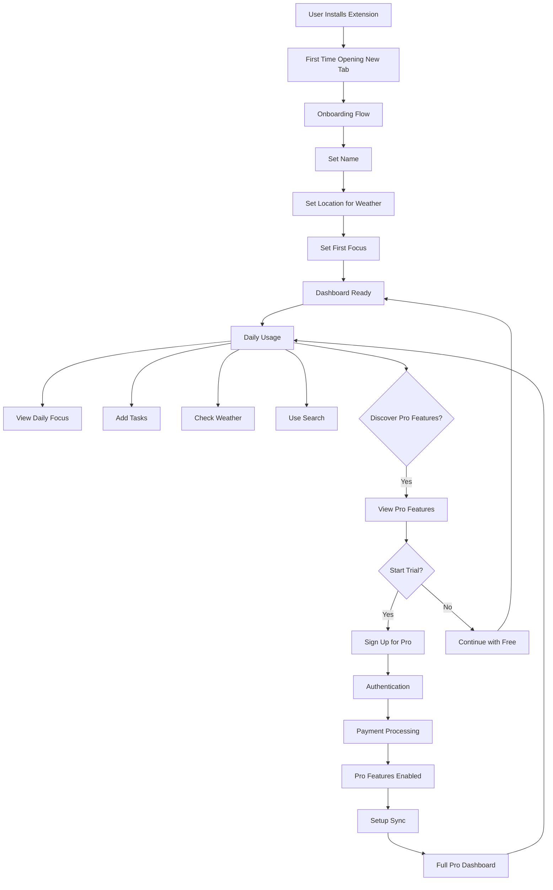
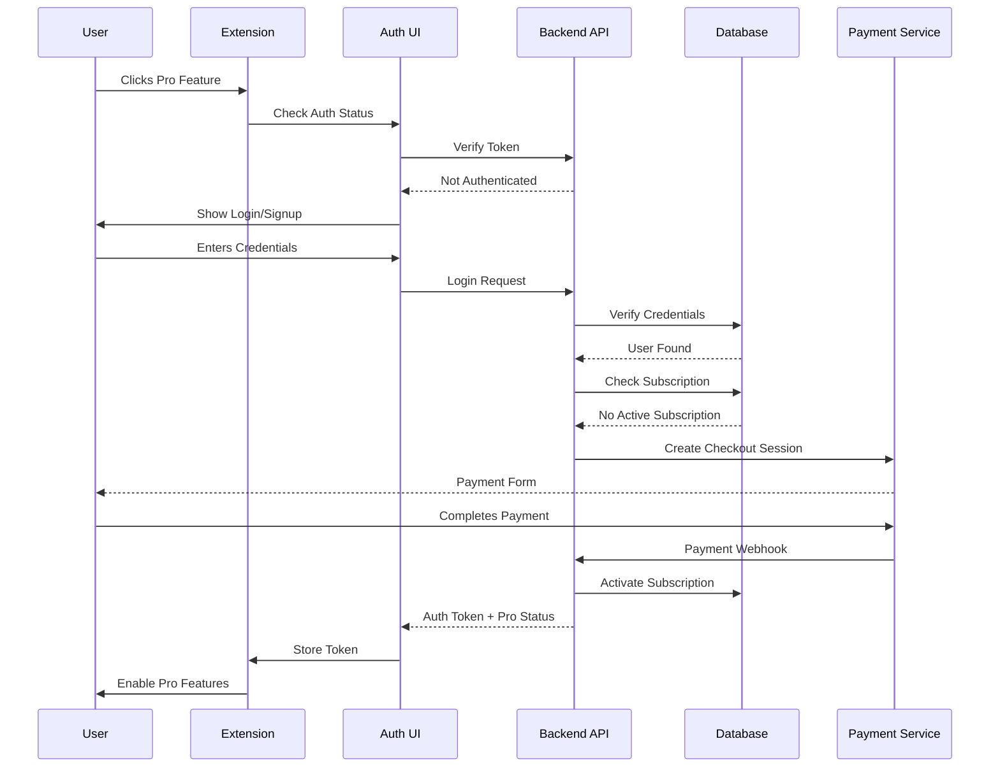

# Momentum Chrome Extension - Complete Specification Document

## Table of Contents
1. [Overview](#overview)
2. [Architecture & Technical Foundation](#architecture--technical-foundation)
3. [Free Features - Detailed Specifications](#free-features---detailed-specifications)
4. [Pro Features - Detailed Specifications](#pro-features---detailed-specifications)
5. [User Interface & User Experience](#user-interface--user-experience)
6. [Data Storage & Synchronization](#data-storage--synchronization)
7. [API Integrations](#api-integrations)
8. [Browser Compatibility](#browser-compatibility)
9. [Privacy & Security](#privacy--security)
10. [Development Considerations](#development-considerations)

---

## Overview

Momentum is a browser extension that replaces the default new tab page with a personalized productivity dashboard. It combines daily inspiration, task management, weather information, and various productivity tools into a single, customizable interface.

### Core Purpose
- Transform the new tab page into a productivity-focused dashboard
- Provide daily inspiration through backgrounds, quotes, and mantras
- Enable task management and focus tracking
- Integrate with third-party productivity tools
- Offer both free and premium (Pro) feature tiers

### Target Users
- Professionals seeking productivity enhancement
- Students managing daily tasks
- Anyone wanting an organized, inspiring start to their browsing sessions

---

## Architecture & Technical Foundation

### Extension Structure

#### Manifest Configuration
- **Extension Type**: Browser extension (Chrome, Firefox, Safari, Edge compatible)
- **New Tab Override**: Uses `chrome_url_overrides` to replace default new tab page
- **Permissions Required**:
  - `tabs` - For tab management and bookmark access
  - `storage` - For local data persistence
  - `bookmarks` - For bookmark synchronization
  - `geolocation` - For weather location detection
  - `activeTab` - For tab-related features
  - `identity` - For user authentication (Pro features)

#### Core Components
1. **New Tab Page (HTML/CSS/JS)**
   - Main dashboard interface
   - Widget system for modular features
   - Responsive layout engine

2. **Background Service Worker**
   - Handles API calls
   - Manages data synchronization
   - Processes background tasks

3. **Content Scripts** (if needed)
   - For bookmark integration
   - Tab management features

4. **Settings Page**
   - User preferences management
   - Feature toggles
   - Account management

5. **Backend Services** (for Pro features)
   - User authentication
   - Data synchronization server
   - Subscription management
   - AI service integration

### Technology Stack Recommendations
- **Frontend**: HTML5, CSS3, JavaScript (ES6+)
- **Framework Options**: Vanilla JS, React, or Vue.js for widget system
- **Storage**: Chrome Storage API (local and sync)
- **Backend**: Node.js/Express or similar for Pro features
- **Database**: For user accounts and sync data
- **APIs**: Weather API, Unsplash API, Quote APIs, Task management APIs

### System Architecture Diagram



### Data Flow Diagram



### Feature Architecture Diagram



---

## Free Features - Detailed Specifications

### 1. Daily Inspirational Content

#### Background Images
- **Source**: Curated collection of high-quality landscape/nature photos
- **Update Frequency**: New image each day at midnight (user's timezone)
- **Display**: Full-screen background with overlay effects for readability
- **Technical Implementation**:
  - Fetch from Unsplash API or similar service
  - Cache image for offline viewing
  - Preload next day's image
  - Attribution display (if required by API)

#### Daily Quotes
- **Content**: Motivational and inspirational quotes
- **Update Frequency**: New quote each day
- **Display**: Prominently displayed on dashboard
- **Technical Implementation**:
  - Quote API integration or curated database
  - Random selection from collection
  - Text overlay on background image

#### Daily Mantras
- **Content**: Short, motivational phrases
- **Update Frequency**: New mantra each day
- **Display**: Smaller text, often near quote or focus area
- **Technical Implementation**:
  - Curated collection or API
  - Rotate daily with quote

### 2. Focus Mode

#### Basic Functionality
- **Purpose**: Set and display a single daily focus/goal
- **User Input**: Text field to enter focus statement
- **Display**: Large, prominent text on dashboard
- **Persistence**: Saved per day, resets at midnight
- **Free Limitations**: One focus per day

#### Technical Implementation
- Store focus text in local storage
- Date-based storage key (YYYY-MM-DD)
- Auto-reset mechanism at midnight
- Simple text input with save functionality

### 3. To-Do List

#### Basic Task Management
- **Features**:
  - Add new tasks
  - Mark tasks as complete (check/uncheck)
  - Delete tasks
  - Simple text-based tasks (no due dates in free version)
- **Storage**: Local storage per day
- **Display**: List format with checkboxes
- **Free Limitations**: Single list, no categories or priorities

#### Technical Implementation
- Array-based task storage
- CRUD operations for tasks
- Checkbox state management
- Strikethrough styling for completed tasks
- Task persistence across sessions

### 4. Quick Links / Launchpad

#### Functionality
- **Purpose**: Quick access to frequently visited websites
- **Features**:
  - Add custom links with name and URL
  - Display as clickable icons or buttons
  - Edit/delete links
  - Optional: Auto-detect favicon from URL
- **Display**: Grid or list layout
- **Storage**: Local storage array

#### Technical Implementation
- Link object structure: `{id, name, url, icon}`
- Favicon fetching from URL or favicon API
- Drag-and-drop reordering (optional)
- Click handler to open links in new tab

### 5. Weather Information

#### Basic Weather Display
- **Data Shown**:
  - Current temperature
  - Weather condition (sunny, cloudy, etc.)
  - Weather icon
- **Location Detection**:
  - Browser geolocation API (with permission)
  - Fallback to IP-based location
  - Manual location entry option
- **Update Frequency**: Refresh on page load, periodic updates

#### Technical Implementation
- Weather API integration (OpenWeatherMap, WeatherAPI, etc.)
- Location permission request
- Cached weather data with expiration
- Error handling for API failures
- Unit preference (Celsius/Fahrenheit)

### 6. Search Functionality

#### Search Bar
- **Features**:
  - Prominent search input field
  - Multiple search engine options:
    - Google (default)
    - Bing
    - DuckDuckGo
    - Ecosia
  - Search provider selection in settings
- **Functionality**: Redirects to selected search engine with query

#### Technical Implementation
- Search URL templates for each provider
- User preference storage for default provider
- Enter key handler for search submission
- Optional: Search suggestions/autocomplete

### 7. Bookmarks Bar

#### Browser Bookmarks Integration
- **Purpose**: Display browser bookmarks on dashboard
- **Features**:
  - Sync with browser's bookmark bar
  - Display most frequently visited sites
  - Quick access to bookmarks
- **Technical Implementation**:
  - Chrome Bookmarks API integration
  - Read-only access to bookmarks
  - Display as icons or list
  - Click to open in new tab

### 8. Customizable Settings

#### Settings Panel
- **Features**:
  - Show/hide individual widgets
  - Toggle features on/off
  - Search provider selection
  - Time format (12-hour/24-hour)
  - Temperature unit preference
  - Basic appearance options

#### Technical Implementation
- Settings object stored in local storage
- Widget visibility toggles
- Settings page/modal interface
- Real-time application of settings

### 9. Clock Display

#### Time Display
- **Features**:
  - Current time display
  - Date display
  - Large, readable font
- **Format Options** (Free):
  - 12-hour format
  - 24-hour format
- **Update**: Real-time updates every second

#### Technical Implementation
- JavaScript Date object
- setInterval for time updates
- Format conversion based on user preference
- Timezone handling

---

## Pro Features - Detailed Specifications

### 1. Unlimited Focus Mode

#### Enhanced Focus Features
- **Multiple Focus Items**: Set multiple focuses throughout the day
- **Focus History**: Track focus completion
- **Focus Analytics**: View focus patterns over time
- **Focus Reminders**: Optional notifications

#### Technical Implementation
- Array-based focus storage (vs single value)
- Focus completion tracking
- Analytics dashboard
- Notification API integration

### 2. Vision Board

#### Custom Background System
- **Features**:
  - Upload custom images
  - Multiple image uploads
  - Image gallery management
  - Set as background
  - Image rotation schedule
- **Storage**: Cloud storage for Pro users (or local with size limits)

#### Technical Implementation
- File upload interface
- Image compression/optimization
- Storage API (cloud or Chrome storage)
- Image gallery UI
- Background rotation logic

### 3. Tab Stash

#### Tab Management
- **Purpose**: Save and organize open tabs for later
- **Features**:
  - Save current tabs as a "stash"
  - Name stashes
  - View saved stashes
  - Restore stashes (open all tabs)
  - Delete stashes
  - Multiple stashes support

#### Technical Implementation
- Chrome Tabs API integration
- Tab URL and title capture
- Stash storage structure
- Batch tab opening functionality
- Stash management UI

### 4. Notes AI

#### AI-Powered Note Taking
- **Features**:
  - Rich text note editor
  - AI suggestions for note organization
  - AI-generated summaries
  - Note categorization
  - Search within notes
- **AI Integration**: OpenAI API, Claude API, or similar

#### Technical Implementation
- Rich text editor (contentEditable or library)
- AI API integration
- Note storage (cloud sync for Pro)
- Search functionality
- Note organization system

### 5. Ask AI

#### AI Assistant Feature
- **Purpose**: AI-powered productivity assistant
- **Features**:
  - Chat interface with AI
  - Productivity tips and suggestions
  - Task prioritization help
  - Goal setting assistance
  - Quick answers to questions

#### Technical Implementation
- Chat UI component
- AI API integration (OpenAI, Anthropic, etc.)
- Conversation history storage
- Context-aware responses
- Rate limiting for API calls

### 6. Soundscapes

#### Ambient Sound Player
- **Features**:
  - Library of ambient sounds:
    - Rain
    - Forest
    - Ocean waves
    - Coffee shop
    - White noise
    - Focus music
  - Play/pause controls
  - Volume control
  - Multiple sound mixing (optional)
  - Background playback

#### Technical Implementation
- Audio file storage (or streaming)
- HTML5 Audio API
- Audio player controls
- Volume management
- Background playback handling
- Sound library management

### 7. Task Manager Integrations

#### Third-Party Integrations
- **Supported Services**:
  - Todoist
  - Asana
  - ClickUp
  - Trello (optional)
  - GitHub Issues (optional)
- **Features**:
  - OAuth authentication
  - Sync tasks from external services
  - Display tasks on dashboard
  - Mark complete (sync back)
  - Create tasks (sync to service)

#### Technical Implementation
- OAuth 2.0 flow for each service
- Service-specific API integration
- Task mapping between services
- Sync mechanism (polling or webhooks)
- Error handling and retry logic
- Credential storage (encrypted)

### 8. Metrics Tracking

#### Productivity Metrics
- **Tracked Metrics**:
  - Tasks completed per day/week/month
  - Focus completion rate
  - Time spent on dashboard
  - Habit tracking
  - Productivity streaks
- **Features**:
  - Visual charts and graphs
  - Historical data view
  - Export data (optional)
  - Goal setting

#### Technical Implementation
- Metrics data collection
- Time-series data storage
- Chart library integration (Chart.js, D3.js, etc.)
- Analytics dashboard
- Data aggregation logic

### 9. Habit Tracker

#### Habit Management
- **Features**:
  - Create custom habits
  - Daily habit check-ins
  - Habit streaks tracking
  - Habit completion calendar
  - Habit statistics

#### Technical Implementation
- Habit data structure
- Daily check-in system
- Streak calculation logic
- Calendar visualization
- Statistics calculations

### 10. Advanced To-Do Lists

#### Enhanced Task Management
- **Features**:
  - Multiple lists/categories
  - Task priorities
  - Due dates
  - Task notes
  - Subtasks
  - Task tags
  - Task search and filtering

#### Technical Implementation
- Enhanced task data structure
- List management system
- Priority and date sorting
- Task filtering logic
- Advanced UI for task management

### 11. Pomodoro Timer

#### Time Management
- **Features**:
  - 25-minute work sessions
  - 5-minute short breaks
  - 15-minute long breaks (after 4 sessions)
  - Visual timer display
  - Sound notifications
  - Session statistics
  - Customizable durations

#### Technical Implementation
- Timer logic (countdown)
- Session state management
- Break detection
- Notification system
- Statistics tracking
- Settings for durations

### 12. Autofocus Mode

#### Sequential Task Focus
- **Purpose**: Show one task at a time
- **Features**:
  - Display only current task
  - Auto-advance to next task on completion
  - Focus on single task
  - Task queue management

#### Technical Implementation
- Task queue system
- Current task tracking
  - Auto-advance logic
  - UI for single task display

### 13. Countdown Timers

#### Event Countdowns
- **Features**:
  - Create countdown timers
  - Name events
  - Set target dates/times
  - Display countdown on dashboard
  - Multiple countdowns
  - Notifications before events

#### Technical Implementation
- Countdown calculation logic
- Date/time handling
- Multiple timer management
- Display formatting
- Notification scheduling

### 14. World Clocks

#### Multiple Time Zones
- **Features**:
  - Add multiple world clocks
  - Select cities/timezones
  - Display multiple times simultaneously
  - 12/24-hour format
  - Clock labels

#### Technical Implementation
- Timezone library (moment-timezone, date-fns-tz)
- Multiple clock rendering
- Real-time updates
- City/timezone selection UI

### 15. Premium Weather

#### Enhanced Weather Information
- **Additional Data**:
  - Extended forecasts (7-day, 14-day)
  - Hourly forecasts
  - Weather alerts
  - Detailed conditions
  - Weather maps (optional)
  - Air quality index

#### Technical Implementation
- Premium weather API integration
- Extended forecast display
- Weather alert system
- Enhanced UI for weather data

### 16. Balance Mode

#### Work-Life Balance Tracking
- **Features**:
  - Visual indicators for work/rest balance
  - Time tracking for work vs personal
  - Balance reminders
  - Weekly balance reports

#### Technical Implementation
- Time tracking system
- Category classification (work/personal)
- Balance calculation
- Visual indicators
- Reporting system

### 17. Multiple Workspaces

#### Context Switching
- **Features**:
  - Create multiple workspaces
  - Switch between workspaces
  - Workspace-specific:
    - Tasks
    - Links
    - Focus items
    - Settings
  - Workspace naming and customization

#### Technical Implementation
- Workspace data structure
- Workspace switching logic
- Isolated data per workspace
- Workspace management UI

---

## User Interface & User Experience

### Dashboard Layout

#### Main Components
1. **Background Layer**
   - Full-screen background image
   - Overlay for readability
   - Gradient or blur effects

2. **Central Content Area**
   - Large clock display
   - Daily focus/goal
   - Daily quote
   - Date display

3. **Widget Areas**
   - Top area: Weather, time
   - Left/Right: Quick links, bookmarks
   - Bottom: To-do list, notes
   - Customizable positioning

4. **Search Bar**
   - Prominent placement (usually center-top)
   - Search provider indicator

5. **Settings Access**
   - Gear icon (usually top-right)
   - Settings panel/modal

### Design Principles
- **Minimalism**: Clean, uncluttered interface
- **Focus**: Prominent display of daily focus
- **Readability**: High contrast text on backgrounds
- **Customization**: User control over layout
- **Responsiveness**: Adapts to different screen sizes

### Widget System
- **Modular Design**: Each feature is a widget
- **Drag-and-Drop**: Reposition widgets (Pro feature)
- **Show/Hide**: Toggle widget visibility
- **Resize**: Adjust widget sizes (Pro feature)
- **Widget Types**: Clock, Weather, Tasks, Links, Notes, etc.

### Widget Interaction Flow



### Responsive Design
- **Desktop**: Full widget layout
- **Tablet**: Adjusted layout
- **Mobile**: Simplified, stacked layout
- **Breakpoints**: Standard responsive breakpoints

### User Journey Flow



### Authentication Flow Pro Features



### Color Themes
- **Free**: Default theme with daily backgrounds
- **Pro**: Custom themes, dark mode, color customization

### Typography
- **Clock**: Large, bold font
- **Focus**: Medium-large, readable font
- **Quotes**: Elegant, readable font
- **Tasks/Links**: Standard readable font
- **Font Options**: System fonts or web fonts

---

## Data Storage & Synchronization

### Local Storage (Free Features)

#### Chrome Storage API
- **Storage Type**: `chrome.storage.local`
- **Data Stored**:
  - User preferences
  - To-do lists
  - Quick links
  - Focus items
  - Settings
  - Widget positions
- **Limits**: ~10MB per extension
- **Persistence**: Survives extension updates

#### Data Structure Examples
```javascript
// Tasks
tasks: [
  {id: 1, text: "Task 1", completed: false, date: "2024-01-15"},
  {id: 2, text: "Task 2", completed: true, date: "2024-01-15"}
]

// Links
links: [
  {id: 1, name: "Google", url: "https://google.com", icon: "..."}
]

// Settings
settings: {
  searchProvider: "google",
  timeFormat: "12h",
  temperatureUnit: "celsius",
  widgets: {weather: true, tasks: true, ...}
}
```

### Cloud Synchronization (Pro Features)

#### Sync Storage
- **Storage Type**: `chrome.storage.sync` (limited) or backend API
- **Data Synced**:
  - User account data
  - Tasks across devices
  - Settings across devices
  - Vision board images
  - Notes
  - Metrics data
- **Backend Requirements**:
  - User authentication
  - Database for user data
  - API endpoints for sync
  - Conflict resolution

#### Synchronization Flow
1. User logs in with account
2. Local data syncs to cloud
3. Changes sync bidirectionally
4. Conflict resolution (last write wins or merge)
5. Real-time or periodic sync

### Data Persistence Strategy
- **Immediate Save**: Save on every change
- **Debouncing**: For rapid changes (typing)
- **Error Handling**: Retry failed saves
- **Offline Support**: Queue changes when offline

---

## API Integrations

### Required APIs

#### 1. Weather API
- **Options**:
  - OpenWeatherMap API
  - WeatherAPI.com
  - AccuWeather API
- **Required Data**:
  - Current temperature
  - Weather condition
  - Weather icon
  - Location data
- **Pro Features**:
  - Extended forecasts
  - Hourly data
  - Weather alerts

#### 2. Background Images API
- **Options**:
  - Unsplash API
  - Pexels API
  - Custom curated collection
- **Required Data**:
  - High-resolution images
  - Image metadata
  - Attribution information

#### 3. Quotes API
- **Options**:
  - Quote API services
  - Curated database
  - Custom collection
- **Required Data**:
  - Quote text
  - Author (optional)
  - Category (optional)

#### 4. Task Management APIs (Pro)
- **Todoist API**
  - OAuth 2.0
  - REST API for tasks
  - Webhooks for real-time updates
- **Asana API**
  - OAuth 2.0
  - REST API
  - Task and project management
- **ClickUp API**
  - OAuth 2.0
  - REST API
  - Task management

#### 5. AI APIs (Pro)
- **OpenAI API**
  - GPT models for Notes AI and Ask AI
  - Text completion
  - Chat functionality
- **Anthropic Claude API**
  - Alternative AI provider
  - Similar functionality

#### 6. Geolocation
- **Browser Geolocation API**
  - User permission required
  - Get coordinates
  - Reverse geocoding for city name

### API Management
- **Rate Limiting**: Handle API rate limits
- **Error Handling**: Graceful degradation
- **Caching**: Cache API responses
- **API Keys**: Secure storage of API keys
- **Fallbacks**: Alternative APIs if primary fails

---

## Browser Compatibility

### Supported Browsers

#### Google Chrome
- **Manifest Version**: Manifest V3
- **APIs Used**: Chrome Extension APIs
- **Storage**: chrome.storage API
- **Minimum Version**: Latest stable

#### Mozilla Firefox
- **Manifest**: WebExtension manifest
- **APIs**: Browser Extension APIs (similar to Chrome)
- **Storage**: browser.storage API
- **Compatibility**: Most Chrome APIs work with polyfills

#### Microsoft Edge
- **Compatibility**: Chromium-based, similar to Chrome
- **APIs**: Same as Chrome
- **Storage**: chrome.storage API

#### Safari
- **Manifest**: Safari App Extension
- **APIs**: Safari-specific APIs
- **Storage**: Different storage mechanism
- **Note**: Requires more adaptation

### Cross-Browser Considerations
- **API Differences**: Handle browser-specific APIs
- **Polyfills**: Use polyfills for compatibility
- **Testing**: Test on all target browsers
- **Feature Detection**: Detect available APIs
- **Fallbacks**: Provide fallbacks for unsupported features

---

## Privacy & Security

### Privacy Principles
- **Data Minimization**: Collect only necessary data
- **Local-First**: Store data locally when possible
- **No Tracking**: No user behavior tracking
- **No Third-Party Sharing**: Don't sell user data
- **Transparency**: Clear privacy policy

### Security Measures

#### Data Protection
- **Encryption**: Encrypt sensitive data (Pro account info)
- **Secure Storage**: Use secure storage APIs
- **API Keys**: Never expose API keys in client code
- **HTTPS**: All API calls over HTTPS

#### Authentication (Pro Features)
- **Secure Login**: Email/password or OAuth
- **Token Management**: Secure token storage
- **Session Management**: Proper session handling
- **Password Security**: Hash passwords (backend)

#### Permissions
- **Minimal Permissions**: Request only necessary permissions
- **Permission Explanation**: Explain why permissions are needed
- **Permission Management**: Allow users to revoke permissions

### Privacy Policy Requirements
- **Data Collection**: What data is collected
- **Data Usage**: How data is used
- **Data Storage**: Where data is stored
- **Third-Party Services**: What third-party services are used
- **User Rights**: How users can access/delete data

---

## Development Considerations

### Project Structure

```
extension/
├── manifest.json
├── background/
│   └── service-worker.js
├── newtab/
│   ├── index.html
│   ├── styles/
│   │   └── main.css
│   ├── scripts/
│   │   ├── main.js
│   │   ├── widgets/
│   │   │   ├── weather.js
│   │   │   ├── tasks.js
│   │   │   ├── links.js
│   │   │   └── ...
│   │   └── utils/
│   └── assets/
├── settings/
│   ├── index.html
│   ├── styles.css
│   └── settings.js
├── popup/ (optional)
└── _locales/ (for internationalization)
```

### Development Phases

#### Phase 1: Core Foundation
1. Extension setup and manifest
2. New tab page replacement
3. Basic layout and styling
4. Settings infrastructure

#### Phase 2: Free Features
1. Daily background images
2. Clock display
3. Daily quotes
4. Focus mode
5. Basic to-do list
6. Quick links
7. Weather widget
8. Search bar
9. Bookmarks integration

#### Phase 3: Pro Infrastructure
1. User authentication system
2. Backend API setup
3. Subscription management
4. Data synchronization
5. Pro feature gating

#### Phase 4: Pro Features
1. Vision board
2. Advanced to-do lists
3. Tab stash
4. Pomodoro timer
5. Metrics tracking
6. Habit tracker
7. World clocks
8. Countdown timers
9. Soundscapes
10. Task manager integrations
11. AI features (Notes AI, Ask AI)
12. Multiple workspaces
13. Balance mode

#### Phase 5: Polish & Optimization
1. Performance optimization
2. Error handling
3. User testing
4. Bug fixes
5. Documentation

### Key Implementation Details

#### New Tab Override
- Use `chrome_url_overrides` in manifest
- Point to local HTML file
- Ensure fast loading

#### Widget System
- Modular widget architecture
- Widget registry
- Widget lifecycle management
- Widget communication system

#### State Management
- Centralized state management
- Event-driven updates
- Persistent state
- State synchronization

#### Performance Optimization
- Lazy loading for widgets
- Image optimization
- Code splitting
- Caching strategies
- Minimize API calls

#### Error Handling
- Graceful degradation
- User-friendly error messages
- Error logging
- Retry mechanisms
- Fallback content

### Testing Strategy
- **Unit Tests**: Individual widget tests
- **Integration Tests**: Widget interactions
- **E2E Tests**: Full user flows
- **Cross-Browser Tests**: All supported browsers
- **Performance Tests**: Load time, memory usage

### Deployment
- **Chrome Web Store**: Prepare store listing
- **Firefox Add-ons**: Prepare Firefox version
- **Edge Add-ons**: Prepare Edge version
- **Safari**: Mac App Store (if applicable)
- **Update Process**: Version management
- **Rollback Plan**: Handle critical bugs

### Monetization Strategy
- **Freemium Model**: Free + Pro tiers
- **Subscription Pricing**: Monthly/yearly options
- **Trial Period**: Free trial for Pro features
- **Payment Processing**: Stripe, PayPal, etc.
- **Subscription Management**: Handle renewals, cancellations

### Future Enhancements
- **Mobile Apps**: iOS/Android companion apps
- **Desktop App**: Electron-based desktop app
- **Browser Extensions**: More browser support
- **Additional Integrations**: More third-party services
- **Community Features**: Sharing, templates
- **Advanced Analytics**: More detailed insights

---

## Feature Comparison: Free vs Pro

### Free Features
- ✅ Daily background images
- ✅ Daily quotes and mantras
- ✅ Single daily focus
- ✅ Basic to-do list (single list)
- ✅ Quick links
- ✅ Basic weather
- ✅ Search bar
- ✅ Bookmarks bar
- ✅ Basic settings
- ✅ Clock display

### Pro Features (All Free Features +)
- ✅ Unlimited focus mode
- ✅ Vision board (custom images)
- ✅ Tab stash
- ✅ Notes AI
- ✅ Ask AI
- ✅ Soundscapes
- ✅ Task manager integrations
- ✅ Metrics tracking
- ✅ Habit tracker
- ✅ Advanced to-do lists (multiple, priorities, dates)
- ✅ Pomodoro timer
- ✅ Autofocus mode
- ✅ Countdown timers
- ✅ World clocks
- ✅ Premium weather
- ✅ Balance mode
- ✅ Multiple workspaces
- ✅ Cloud synchronization
- ✅ Priority support
- ✅ Early access to features

---

## Conclusion

This specification document provides a comprehensive overview of the Momentum Chrome extension, covering all features, technical requirements, and implementation considerations. The document serves as a blueprint for building a similar productivity dashboard extension with both free and premium features.

Key takeaways:
- **Modular Architecture**: Widget-based system for flexibility
- **Progressive Enhancement**: Free features as foundation, Pro as enhancement
- **User-Centric Design**: Focus on productivity and inspiration
- **Privacy-First**: Local storage, minimal data collection
- **Cross-Platform**: Support multiple browsers
- **Scalable**: Architecture supports future features

This specification can be used to guide development, estimate timelines, and ensure all features are properly implemented according to the Momentum extension's functionality.

